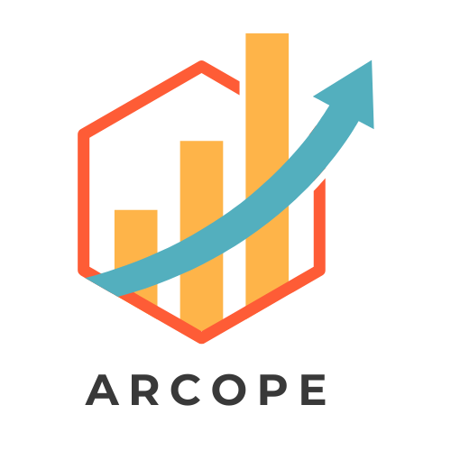

<div align="center">
  

  # ARCOPE · Data Product para Uber NYC

  **Plataforma de análisis de datos orientada a sostenibilidad y rentabilidad para Uber en Nueva York**

  [](https://python.org)
  [](https://streamlit.io)
  [](https://scikit-learn.org)
  [](https://plotly.com)
  [](LICENSE)

  [Ver Demo](#demo) · [Inicio Rápido](#inicio-rápido) · [Arquitectura](#arquitectura)
</div>

---

## El Problema

Uber opera miles de vehículos en NYC con una flota mayoritariamente de combustión interna: altos costos operativos, emisiones crecientes y presión regulatoria creciente. Sin datos claros sobre el impacto real de una transición a vehículos eléctricos/híbridos, es difícil justificar la inversión ante accionistas y reguladores.

## La Solución

ARCOPE es un **Data Product end-to-end** que procesa datos reales de viajes de NYC, calidad del aire y costos operacionales para responder tres preguntas clave:

| Pregunta | KPI |
|---|---|
| ¿Cuánto CO₂ ahorramos migrando a eléctricos? | Reducción de emisiones por flota |
| ¿Es rentable la transición? | Costo/beneficio por milla recorrida |
| ¿Cómo maximizar la eficiencia de la flota actual? | Tasa de utilización y pasajeros/viaje |

---

## Demo

La aplicación incluye cinco módulos navegables:

```
Inicio  →  Análisis Preliminar  →  Dashboard  →  Modelos ML  →  ChatBot
```

| Módulo | Qué muestra |
|---|---|
| **Análisis Preliminar** | EDA interactivo: precios de reventa, costos operacionales por combustible |
| **Dashboard** | KPIs en tiempo real: CO₂/milla, ingresos/milla, utilización de flota |
| **Modelos ML** | Predictor de eficiencia vehicular (Random Forest, ~71k instancias) |
| **ChatBot** | Asistente IA vía Groq para consultas sobre el proyecto |
| **Acerca De** | Contexto del proyecto y equipo |

---

## Arquitectura

```
Fuentes de Datos                   Pipeline                    Producto
─────────────────                 ──────────                  ─────────
TLC Trip Records (NYC)  ──┐
Air Quality Data (NYC)  ──┤──▶  ETL (Pandas/PyArrow) ──▶  Data Lake (MinIO)
Vehicle Cost Dataset    ──┘         │                           │
                                    ▼                           ▼
                              Data Warehouse               MySQL (DW)
                                (MySQL)                        │
                                    │                           │
                              ┌─────┴──────┐                   │
                              ▼            ▼                    ▼
                         Modelo ML    Dashboard         Streamlit App
                     (Random Forest)  (Plotly)         (Multi-página)
                              │
                         Predicciones
                      de eficiencia vehicular
```

**Orquestación:** Apache Airflow gestiona el pipeline ETL → entrenamiento → actualización de dashboards.

---

## Stack Tecnológico

| Capa | Tecnologías |
|---|---|
| **Ingesta & ETL** | Python, Pandas, PyArrow, MinIO |
| **Almacenamiento** | MySQL, SQLAlchemy, Apache Airflow |
| **Machine Learning** | scikit-learn (Random Forest Regressor), Joblib |
| **Visualización** | Plotly, Streamlit, Matplotlib, Seaborn |
| **IA Conversacional** | Groq API (LLM) |
| **Infraestructura** | Servidor local, SSH/VPN, phpMyAdmin |

---

## Inicio Rápido

### Requisitos previos
- Python 3.10+
- MySQL corriendo localmente (o conexión remota configurada)
- Variables de entorno configuradas (ver `.env.example`)

### Instalación

```bash
# 1. Clonar el repositorio
git clone https://github.com/moreiracristian/Henry-Arcope-PF.git
cd Henry-Arcope-PF

# 2. Crear entorno virtual
python -m venv venv
source venv/bin/activate        # Linux/Mac
venv\Scripts\activate           # Windows

# 3. Instalar dependencias
pip install -r modelos_ML/requirements.txt

# 4. Configurar variables de entorno
cp .env.example .env
# Editar .env con tus credenciales (Groq API key, MySQL, etc.)

# 5. Levantar la app principal (desde la raíz del proyecto)
streamlit run Streamlit/app.py
```

La app estará disponible en `http://localhost:8501`.

---

## Estructura del Proyecto

```
Henry-Arcope-PF/
│
├── Streamlit/              # App web principal (multi-página)
│   ├── app.py              # Entry point + navbar
│   ├── inicio.py           # Landing page
│   ├── analisis.py         # EDA interactivo
│   ├── dashboard.py        # KPIs y métricas
│   ├── modelos.py          # Interfaz de predicción ML
│   ├── chatbot.py          # Integración ChatBot
│   └── acercaDe.py         # Info del proyecto y equipo
│
├── modelos_ML/             # Modelos entrenados y notebooks
│   ├── Ml_1.ipynb          # Notebook: modelo base
│   ├── ML_2.ipynb          # Notebook: Random Forest Regressor
│   └── *.joblib            # Modelos serializados
│
├── chatbot/                # ChatBot independiente (Groq API)
│   └── app_groq.py
│
├── data/                   # Datasets procesados (Parquet/CSV)
│   ├── fhv_tripdata.parquet
│   ├── green_tripdata.parquet
│   ├── air_quality_cleaned.parquet
│   └── ...
│
├── dashboard/              # Dashboard alternativo (Power BI / Jupyter)
├── notebook/               # Notebooks de ETL
├── dw/                     # Scripts de Data Warehouse
└── docs/                   # Documentación adicional
```

---

## KPIs del Proyecto

### KPI 1 — Reducción de CO₂
```
Emisiones_flota_actual  vs  Emisiones_flota_eléctrica
Medición: CO₂ (g/milla) por tipo de combustible × millas totales recorridas
```

### KPI 2 — Ingresos por Milla
```
(Total_amount - Tolls_amount - Congestion_Surcharge - Airport_fee) / Trip_distance
Objetivo: identificar zonas y horarios de mayor rentabilidad
```

### KPI 3 — Eficiencia Operativa
```
3a. Tasa de utilización = Total_viajes / Horas_disponibles
3b. Promedio de pasajeros/viaje por zona, servicio y hora
```

---

## Modelo de Machine Learning

El modelo principal es un **Random Forest Regressor** entrenado sobre datos históricos de vehículos para predecir la eficiencia operacional (costo/milla) según:

- Tipo de combustible (eléctrico, híbrido, gasolina, diesel)
- Año del vehículo
- Distancia recorrida acumulada
- Zona de operación en NYC

**Resultado:** el modelo permite simular el ahorro económico y de emisiones al reemplazar vehículos de la flota actual por alternativas eléctricas o híbridas.

---

## Equipo

Proyecto desarrollado en el marco del **Bootcamp de Data Science de Henry** por el equipo ARCOPE:

| Nombre | Rol | LinkedIn | GitHub |
|---|---|---|---|
| Cristian Moreira | Proyect Manager | [](https://www.linkedin.com/in/moreiracristian/) | [](https://github.com/moreiracristian) |
| Andrés | Data Analyst | [](https://linkedin.com) | [](https://github.com) |
| Jeison | Data Scientist | [](https://linkedin.com) | [](https://github.com) |
| Libardo | Data Engineer | [](https://linkedin.com) | [](https://github.com) |
| Lucas | ML Engineer | [](https://linkedin.com) | [](https://github.com) |
| Manuel | Data Analyst | [](https://linkedin.com) | [](https://github.com) |

---

## Datos Fuente

- **TLC Trip Records** — NYC Taxi and Limousine Commission (datos públicos de viajes FHV y Green Taxi)
- **Air Quality Data** — NYC Open Data (calidad del aire por zona)
- **Vehicle Cost Dataset** — costos operacionales por tipo de vehículo y combustible

---

<div align="center">
  <sub>Proyecto Final · Henry Data Science Bootcamp · 2024</sub>
</div>
