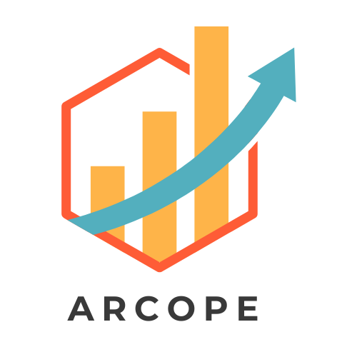

# ARCOPE Proyecto Final - Henry

## Proyecto: Data Product orientado a la sostenibilidad y rentabilidad para Uber en la ciudad de New York.

### Objetivo Principal:
Transformar el negocio de Uber en un referente de sostenibilidad y rentabilidad a largo plazo mediante la optimización operativa, la inversión en tecnología sustentable y la mejora de la imagen corporativa, para atraer tanto a clientes conscientes del medio ambiente como a inversores interesados en sostenibilidad.

### Cliente Objetivo:
Empresa de Ride-Hailing, 'Uber', que conecta pasajeros con conductores de vehículos de alquiler a través de aplicaciones móviles y sitios web.

### Estrategia de Negocio:
Uber busca herramientas para mejorar su imagen corporativa, incrementar la rentabilidad y maximizar la eficiencia operativa, con el objetivo de alinear su negocio hacia un enfoque más sustentable y atractivo para los inversores.

### Alcance:
Proponemos un MVP centrado en analizar y procesar datos proporcionados por Uber y organismos gubernamentales, ofreciendo soluciones que permitan la toma de decisiones estratégicas basadas en sostenibilidad y rentabilidad.

### Contexto:
Ciudad de Nueva York, EEUU.

### Justificación:
El mercado está en plena transición hacia modelos sostenibles. Las empresas que adoptan prácticas sostenibles no solo mejoran su imagen pública, sino que también aseguran su rentabilidad a largo plazo al alinearse con normativas futuras. Este proyecto posicionará a Uber como líder en sostenibilidad en el sector Ride-Hailing, atrayendo a clientes conscientes del medio ambiente y ofreciendo nuevas oportunidades de negocio e incentivos fiscales.

## Objetivos Particulares:

### 1. Mejorar la Imagen Corporativa a través de la Sostenibilidad
- **KPI**: Reducción de CO2 y mejora de la calidad del aire.
- **Medir**: Comparar las emisiones de CO2 de la flota actual con una nueva flota de vehículos híbridos y eléctricos. También se medirá la calidad del aire en áreas con alta concentración de operaciones.
- **Impacto**: Posicionamiento como líder en sostenibilidad, atracción de un segmento de mercado más consciente del medio ambiente, y mejora de la percepción pública.

### 2. Incrementar la Rentabilidad a Largo Plazo mediante Inversión en Vehículos Eléctricos/Híbridos
- **KPI**: Costos y beneficios por vehículo eléctrico en relación a la distancia recorrida.
- **Medir**: Comparar los costos operativos y beneficios de los vehículos eléctricos frente a los de combustión interna.
- **Impacto**: Reducción de costos operativos, acceso a incentivos fiscales, y mejora en la rentabilidad a largo plazo.

### 3. Maximizar la Eficiencia Operativa y la Rentabilidad del Servicio
- **KPI 3a**: Ingresos por milla recorrida. 
  - **Medir**: (Total_amount - Tolls_amount - Congestion_Surcharge - Airport_fee) / Trip_distance.
  - **Impacto**: Optimización de rutas, asignación de vehículos y tarifas para maximizar ingresos.
  
- **KPI 3b**: Tasa de utilización de vehículos.
  - **Medir**: Total de viajes / Número total de horas disponibles.
  - **Impacto**: Incremento de la rentabilidad al mejorar la utilización de la flota.

- **KPI 3c**: Promedio de pasajeros por viaje.
  - **Medir**: Promedio(Passenger_count) por zona, tipo de servicio y hora del día.
  - **Impacto**: Fomento del uso compartido de vehículos para incrementar la rentabilidad y reducir la cantidad de vehículos necesarios.

## Análisis de Impacto:
Implementar estos KPIs proporcionará una visión clara del desempeño de Uber en términos de sostenibilidad y rentabilidad. Basándose en estos análisis, se podrán tomar decisiones estratégicas como expandir la flota de vehículos eléctricos, optimizar rutas para reducir emisiones y costos, y rediseñar campañas de marketing centradas en el compromiso ambiental.

Este proyecto ayudará a Uber no solo a cumplir con sus objetivos de sostenibilidad, sino también a mejorar su imagen pública y garantizar su rentabilidad a largo plazo, consolidándose como un líder en innovación dentro del sector de Ride-Hailing.

---

## **Propuesta y Stack Tecnológico**

---

### **1. Ingesta de Datos y ETL (Extract, Transform, Load)**

**Herramientas y Tecnologías:**

- **Lenguaje de Programación: Python**
  - **Descripción:** Lenguaje versátil y ampliamente utilizado en ciencia de datos y machine learning.
  
- **Bibliotecas de Python:**
  - **Pandas:** Para la manipulación y limpieza de datos provenientes de archivos CSV o Parquet.
  - **PyArrow:** Para leer y escribir archivos Parquet de manera eficiente.
  
- **Data Lake: MinIO**
  - **Descripción:** MinIO es un sistema de almacenamiento de objetos. Se utiliza para almacenar datos en bruto y transformados, facilitando su acceso durante las etapas de ETL.
  
- **Gestión de Entornos:**
  - **Visual Studio Code:** Facilita la gestión de paquetes y entornos virtuales, asegurando que todas las dependencias estén correctamente instaladas.

**Justificación:**
- **Python**, junto con **Pandas** y **PyArrow**, proporciona una solución robusta y flexible para la ingesta y transformación de datos, permitiendo manejar diferentes formatos de archivo de manera eficiente.
- **MinIO** actúa como un Data Lake, proporcionando almacenamiento centralizado y escalable para grandes volúmenes de datos en diferentes formatos, facilitando el acceso rápido y eficiente para las siguientes fases del pipeline.

---

## **2. Ingreso en la Base de Datos (Data Warehouse)**

### **Herramientas y Tecnologías:**

- **Sistema de Gestión de Bases de Datos: MySQL**
  - **Descripción**: Base de datos relacional ampliamente utilizada, adecuada para almacenar datos transformados y modelos entrenados.

- **Interfaz de Administración: phpMyAdmin**
  - **Descripción**: Herramienta web para gestionar MySQL de manera visual y sencilla, facilitando la administración y consulta de la base de datos.

- **Conexión y ORM: SQLAlchemy**
  - **Descripción**: Biblioteca de Python para interactuar con bases de datos SQL de manera eficiente y segura.

### **Justificación:**
MySQL es una opción sólida para almacenar datos estructurados, y phpMyAdmin ofrece una interfaz amigable para la administración. SQLAlchemy simplifica las interacciones entre Python y la base de datos, permitiendo una integración fluida en el pipeline.

---

## **3. Entrenamiento del Modelo de Machine Learning**

### **Herramientas y Tecnologías:**

- **Bibliotecas de Machine Learning:**
  - **Scikit-learn**: Ideal para modelos de machine learning básicos y medianamente complejos, como regresión y clasificación.

- **Serialización de Modelos:**
  - **Pickle**: Para guardar y cargar modelos entrenados de manera sencilla.

- **Entorno de Desarrollo:**
  - **Jupyter Notebook**: Para desarrollar, entrenar y documentar modelos de manera interactiva.

### **Justificación:**
Scikit-learn es perfecto para comenzar con machine learning gracias a su simplicidad y eficacia. Jupyter Notebook facilita la experimentación y documentación del proceso de entrenamiento.

---

## **4. Creación de Dashboards e Informes**

### **Herramientas y Tecnologías:**

- **Visualización de Datos:**
  - **Matplotlib y Seaborn**: Para crear gráficos estáticos y visualizaciones detalladas.
  - **Plotly** (opcional): Para visualizaciones interactivas si se requiere mayor dinamismo en los dashboards.

- **Generación de Informes:**
  - **Jupyter Notebook**: Para crear informes interactivos que combinan código, visualizaciones y texto descriptivo.
  - **ReportLab** (opcional): Para generar informes en formato PDF si se necesita distribuir documentos estáticos.

- **Desarrollo de Dashboards Interactivos:**
  - **Streamlit** o **Dash**: Frameworks de Python para crear aplicaciones web interactivas y dashboards de manera rápida y sencilla.

### **Justificación:**
Matplotlib y Seaborn ofrecen una base sólida para la visualización de datos, mientras que herramientas como Streamlit permiten transformar estos gráficos en dashboards interactivos. Jupyter Notebook combina análisis y visualización en un solo entorno, facilitando la creación de informes comprensibles y detallados.

---

## **Infraestructura y Seguridad**

### **Herramientas y Tecnologías:**

- **Servidor Local:**
  - **Descripción**: Un servidor donde se alojarán MySQL y phpMyAdmin, accesible desde internet para permitir conexiones remotas.

- **Seguridad de la Base de Datos:**
  - **Configuración de MySQL para Acceso Remoto**: Asegurar que MySQL esté configurado para aceptar conexiones remotas de manera segura.
  - **Autenticación y Autorización**: Gestionar permisos de usuarios para controlar el acceso a diferentes partes de la base de datos.
  - **Uso de SSH o VPN**: Para cifrar las conexiones y proteger los datos en tránsito.

- **Orquestador:**
  - **Apache Airflow**: Para gestionar y orquestar los flujos de trabajo de ETL y entrenamiento de modelos.

### **Justificación:**
Garantizar la seguridad es crucial cuando se permite el acceso remoto a la base de datos. Configurar MySQL correctamente y utilizar métodos de cifrado como SSH o VPN protege los datos y asegura que solo usuarios autorizados puedan acceder al sistema. Apache Airflow facilita la automatización y programación de tareas complejas en el flujo de trabajo.

---

## **Resumen del Stack Tecnológico**

| **Fase**                                  | **Herramientas y Tecnologías**                                                                                           |
|-------------------------------------------|--------------------------------------------------------------------------------------------------------------------------|
| **1. Ingesta de Datos y ETL**             | Python, Pandas, PyArrow, MinIO                                                                                           |
| **2. Ingreso en la Base de Datos**        | MySQL, phpMyAdmin, SQLAlchemy                                                                                              |
| **3. Entrenamiento de Machine Learning**  | Scikit-learn, Pickle, Jupyter Notebook                                                   |
| **4. Creación de Dashboards e Informes**  | Matplotlib, Seaborn, Plotly, Jupyter Notebook, Streamlit/Dash                            |
| **5. Orquestador**                       | Apache Airflow                                                                                                            |
| **Infraestructura y Seguridad**           | Servidor Local, Configuración de MySQL para Acceso Remoto, SSH/VPN                                                        |

---

### **Ejemplo de Diagrama:**

1. **Ingesta de Datos y ETL**
   - MinIO → Python → Pandas/PyArrow → Transformaciones → Python

2. **Ingreso en la Base de Datos**
   - Python/SQLAlchemy → MySQL → phpMyAdmin

3. **Entrenamiento de ML**
   - MySQL → Python/Scikit-learn → Modelo Entrenado → MySQL

4. **Creación de Dashboards e Informes**
   - MySQL → Python/Matplotlib/Seaborn → Jupyter Notebook/Streamlit → Dashboards/Informes

5. **Orquestación**
   - Apache Airflow → Ingesta de Datos y ETL → Entrenamiento de ML → Creación de Dashboards e Informes

---
